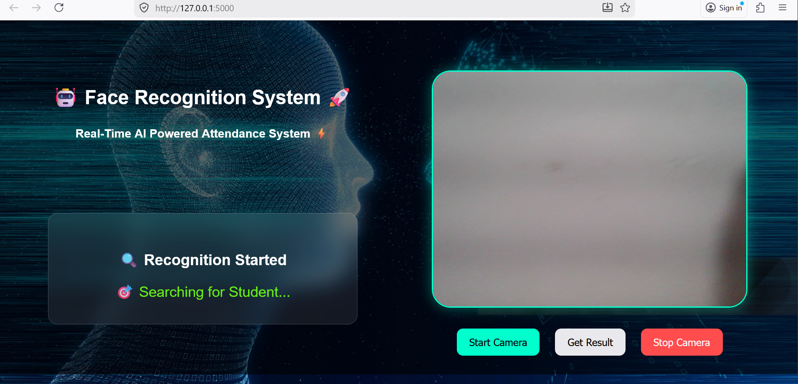
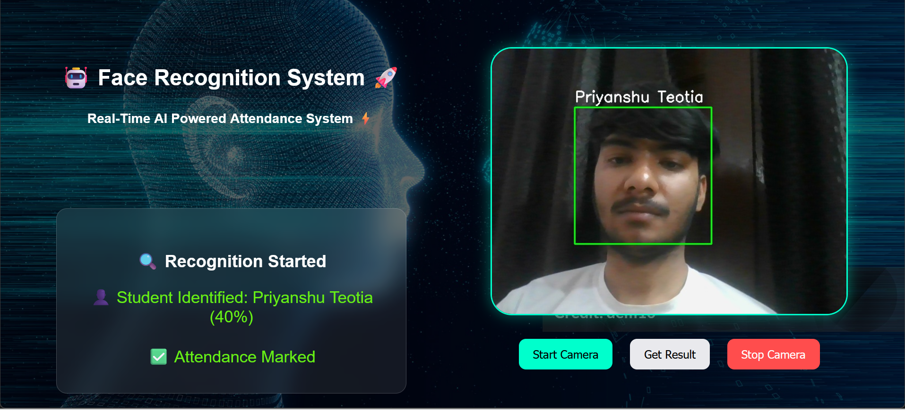

# Face Recognition Attendance System

## 📌 Overview
This project is a Face Recognition based Attendance System built using Python, OpenCV and Flask.

## 🚀 Features
- Real-time face detection
- Face recognition using LBPH
- Add new users
- Web interface using Flask

## 📸 Screenshots

### UI

### Recognition

## 🛠️ Tech Stack
- Python
- OpenCV
- Flask
- NumPy

## ▶️ How to Run
1. pip install -r requirements.txt  
2. python app.py  
3. Open http://127.0.0.1:5000/

## 📁 Project Structure
- app.py → Main Flask app  
- dataset_creator.py → Create dataset  
- trainer.py → Train model  
- recognizer.py → Recognize faces  

## ⚠️ Note
Dataset is not uploaded due to size. You can create your own dataset using dataset_creator.py.

## 👨‍💻 Author
Priyanshu Teotia
